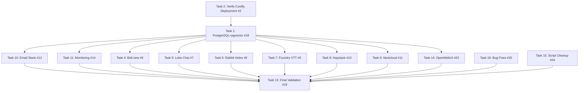

# Future-Stack Deployment Architecture

## Phased Execution Plan



## Execution Sequence

### Phase 1: Foundational Infrastructure

1. `#2` Coolify Verification (Critical Path)
2. `#18` PostgreSQL+pgvector Deployment
3. `#12` Email Stack
4. `#14` Monitoring

### Phase 2: Core Services (Parallelizable)

- `#6` Bolt.new
- `#7` Lobe Chat  
- `#8` Rabbit Holes
- `#9` Foundry VTT
- `#10` Haystack
- `#11` Nextcloud
- `#23` OpenWebUI

### Phase 3: Maintenance & Validation

1. `#25` Critical Bug Fixes
2. `#24` Script Optimization
3. `#16` System Validation

## Key Integration Points

1. PostgreSQL Service Mesh:

```c4
ContainerDb(postgres, "PostgreSQL 15+", "pgvector 0.7+")
Container(coolify, "Coolify", "Docker Orchestrator")
Container(service, "Application Services") --> postgres
coolify --> service
```

2. Monitoring Architecture:

```plantuml
[Prometheus]-down->[Grafana]
[Node Exporter]-up->[Prometheus] 
[CAdvisor]-up->[Prometheus]
[Application Services]-->[Node Exporter]
[Application Services]-->[CAdvisor]
```

## Security Boundaries

1. Database Access:
   - TLS 1.3 for all PostgreSQL connections
   - Service-specific credentials
   - Connection pooling via PgBouncer

2. Deployment Guardrails:
   - Isolated Docker networks per service group
   - Traefik TLS termination
   - Automated certificate rotation
